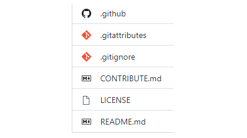

    <h1>GitHub Icons</h1>
    
    
    

# Installation
1. Install Stylus ([Chrome Web Store](https://chrome.google.com/webstore/detail/stylus/clngdbkpkpeebahjckkjfobafhncgmne), [Firefox add-ons](https://addons.mozilla.org/ru/firefox/addon/styl-us/), or from [GitHub](https://github.com/openstyles/stylus))
2. Install the extension from [UserStyles.world](https://userstyles.world/style/8856/github-icons) or [releases](https://github.com/the-userr/GitHub-Icons/releases)

You can also change the icons to your own in Stylus

# Supported Extensions
You can find the list of supported extensions [here](SUPPORTED_EXTENSIONS.md)

# Sources
* [Wikimedia Commons](https://commons.wikimedia.org/) - icons
